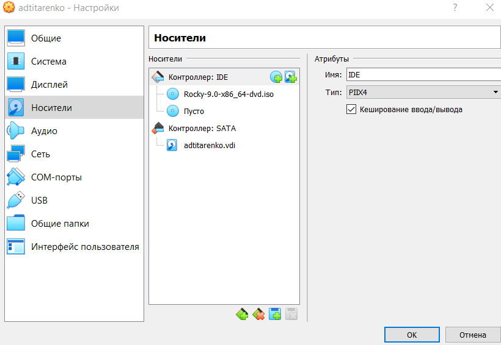

# Лабораторная работа №1
<!-- _class: fio -->
Титаренко Анастасия 
НПИбд-02-19

---
## Цель работы
  Целью данной работы является приобретение практических навыков установки операционной системы на виртуальную машину, настройки минимально необходимых для дальнейшей работы сервисов.

---
### Выполнение лабораторной работы

---  

---

---
  

---
  

---
  

---
  

---
  

---
  

---
  

---
  

---
  

---
  

---
  

---
  

---
  

---
  

---
  

---
  

---
## Вывод
Приобрела практические навыки установки операционной системы на виртуальную машину, настройки минимально необходимых для дальнейшей работы сервисов.
