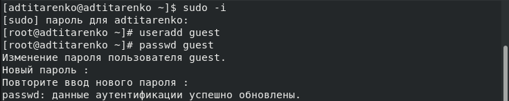
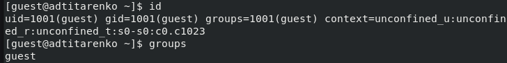
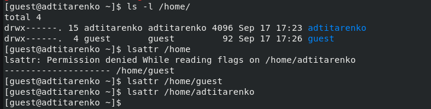
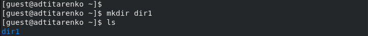
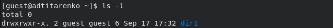
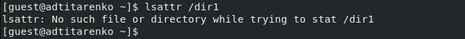
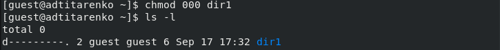
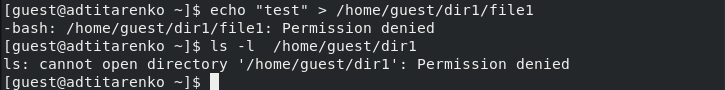
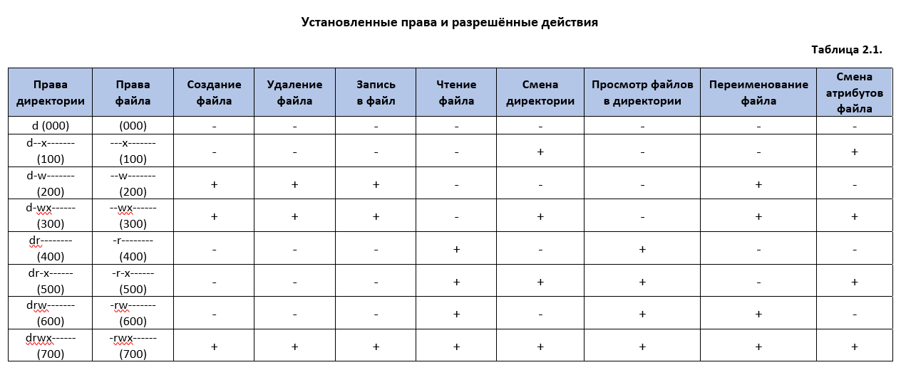
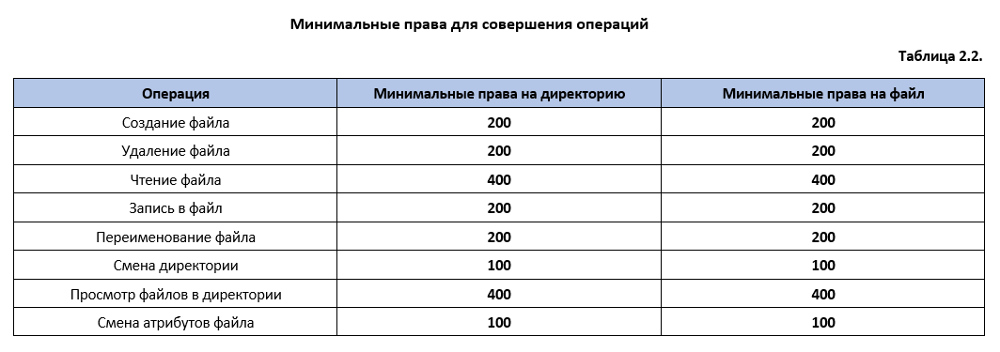

---
# Front matter
title: "Лабораторная работа №2"
author: "Титаренко Анастасия Дмитриевна"

# Generic otions
lang: ru-RU
toc-title: "Содержание"

# Bibliography
bibliography: bib/cite.bib
csl: pandoc/csl/gost-r-7-0-5-2008-numeric.csl

# Pdf output format
toc: true # Table of contents
toc_depth: 2
lof: true # List of figures
lot: true # List of tables
fontsize: 12pt
linestretch: 1.5
papersize: a4
documentclass: scrreprt
## I18n
polyglossia-lang:
  name: russian
  options:
  - spelling=modern
  - babelshorthands=true
polyglossia-otherlangs:
  name: english
### Fonts
mainfont: PT Serif
romanfont: PT Serif
sansfont: PT Sans
monofont: PT Mono
mainfontoptions: Ligatures=TeX
romanfontoptions: Ligatures=TeX
sansfontoptions: Ligatures=TeX,Scale=MatchLowercase
monofontoptions: Scale=MatchLowercase,Scale=0.9
## Biblatex
biblatex: true
biblio-style: "gost-numeric"
biblatexoptions:
  - parentracker=true
  - backend=biber
  - hyperref=auto
  - language=auto
  - autolang=other*
  - citestyle=gost-numeric
## Misc options
indent: true
header-includes:
  - \linepenalty=10 # the penalty added to the badness of each line within a paragraph (no associated penalty node) Increasing the value makes tex try to have fewer lines in the paragraph.
  - \interlinepenalty=0 # value of the penalty (node) added after each line of a paragraph.
  - \hyphenpenalty=50 # the penalty for line breaking at an automatically inserted hyphen
  - \exhyphenpenalty=50 # the penalty for line breaking at an explicit hyphen
  - \binoppenalty=700 # the penalty for breaking a line at a binary operator
  - \relpenalty=500 # the penalty for breaking a line at a relation
  - \clubpenalty=150 # extra penalty for breaking after first line of a paragraph
  - \widowpenalty=150 # extra penalty for breaking before last line of a paragraph
  - \displaywidowpenalty=50 # extra penalty for breaking before last line before a display math
  - \brokenpenalty=100 # extra penalty for page breaking after a hyphenated line
  - \predisplaypenalty=10000 # penalty for breaking before a display
  - \postdisplaypenalty=0 # penalty for breaking after a display
  - \floatingpenalty = 20000 # penalty for splitting an insertion (can only be split footnote in standard LaTeX)
  - \raggedbottom # or \flushbottom
  - \usepackage{float} # keep figures where there are in the text
marp: false
  - \floatplacement{figure}{H} # keep figures where there are in the text
---

# Цель работы

Получение практических навыков работы в консоли с атрибутами файлов, закрепление теоретических основ дискреционного разграничения доступа в современных системах с открытым кодом на базе ОС Linux.

# Выполнение лабораторной работы
1. В установленной при выполнении предыдущей лабораторной работы
операционной системе создала учётную запись пользователя guest (используя учётную запись администратора)
2. Задала пароль для пользователя guest (используя учётную запись администратора)

{ #fig:001 width=70% }

3. Вошла в систему от имени пользователя guest.

{ #fig:002 width=70% }

4. Командой pwd определила директорию, в которой нахожусь - /home/guest.  Она является домашней директорией.

{ #fig:003 width=70% }

5. Уточнила имя пользователя командой whoami.

{ #fig:004 width=70% }

6. Уточнила имя пользователя, его группу, а также группы, куда входит пользователь, командой id. Выведенные значения uid, gid и др. сравнила вывод id с выводом команды groups.
7. Если сравнивать команды, то можно заметить, что команда groups выводит информацию только о названии группы, в которую входит пользователь guest.

{ #fig:005 width=70% }

8. Просмотрела файл /etc/passwd командой
cat /etc/passwd
Нашла в нём свою учётную запись. Определила uid - 1001 пользователя.
Определила gid - 1001 пользователя. Найденные значения с полученными в предыдущих пунктах совпадают.

{ #fig:006 width=70% }

9. Определила существующие в системе директории командой
ls -l /home/
10. Проверила, какие расширенные атрибуты установлены на поддиректориях, находящихся в директории /home, командой:
lsattr /home

{ #fig:007 width=70% }

11. Создала в домашней директории поддиректорию dir1 командой
mkdir dir1
Определила командами ls -l и lsattr, какие права доступа и расширенные атрибуты были выставлены на директорию dir1.

{ #fig:008 width=70% }

{ #fig:009 width=70% }

{ #fig:010 width=70% }

12. Сняла с директории dir1 все атрибуты командой
chmod 000 dir1
и проверила с её помощью правильность выполнения команды
ls -l

{ #fig:011 width=70% }

13. Попыталась создать в директории dir1 файл file1 командой
echo "test" > /home/guest/dir1/file1
Получила отказ в выполнении операции по созданию файла. Проверила командой
ls -l /home/guest/dir1
действительно ли файл file1 не находится внутри директории dir1.

{ #fig:012 width=70% }

14. Заполнила таблицу «Установленные права и разрешённые действия»
(см. табл. 2.1), выполняя действия от имени владельца директории (файлов), определив опытным путём, какие операции разрешены, а какие нет.

{ #fig:013 width=70% }

15. На основании заполненной таблицы определила те или иные минимально необходимые права для выполнения операций внутри директории
dir1, заполнила табл. 2.2.

{ #fig:014 width=70% }

# Вывод
Приобрела практические навыки работы в консоли с атрибутами файлов, закрепила теоретические основы дискреционного разграничения доступа в современных системах с открытым кодом на базе ОС Linux.

# Список литературы
1. [Лабораторная работа № 2.  Дискреционное разграничение прав в Linux. Основные атрибуты](https://esystem.rudn.ru/pluginfile.php/1652019/mod_resource/content/6/002-lab_discret_attr.pdf)