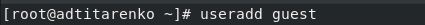
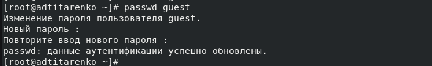
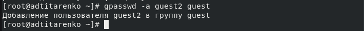
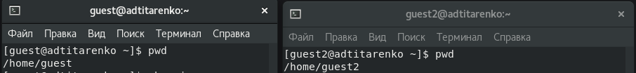

---
## Front matter
lang: ru-RU
title: "Лабораторная работа №3"
subtitle: "Дискреционное разграничение прав в Linux. Два пользователя"
author:
    Титаренко Анастасия
    НПИбд-02-19\inst{1}
institute: |
	\inst{1}RUDN University, Moscow, Russian Federation
date: 2022, 24 September, Moscow, Russian Federation  

## Formatting
mainfont: PT Serif
romanfont: PT Serif
sansfont: PT Sans
monofont: PT Mono
toc: false
slide_level: 2
theme: metropolis
header-includes: 
 - \metroset{progressbar=frametitle,sectionpage=progressbar,numbering=fraction}
 - '\makeatletter'
 - '\beamer@ignorenonframefalse'
 - '\makeatother'
 - \usepackage[T2A]{fontenc}
 - \usepackage{amsmath}
aspectratio: 43
section-titles: true
---

# Цель работы
Получение практических навыков работы в консоли с атрибутами файлов для групп пользователей.

# Создание пользователя guest

{ #fig:001 width=70% }

# Создание пароля для пользователя guest

{ #fig:002 width=70% }

# Создание пользователя guest2

{ #fig:003 width=70% }

# Добавление пользователя guest2 в группу guest

{ #fig:004 width=70% }

# Вход под двумя пользователями

{ #fig:005 width=70% }

# Определение домашней директории

{ #fig:006 width=70% }

# Определение имени пользователя, его группы, кто входит в неё и к каким группам принадлежит он сам

{ #fig:007 width=70% }

# Просмотр информации о пользователях в файле /etc/group

{ #fig:008 width=70% }

# Регистрация пользователя guest2 в группе guest

{ #fig:009 width=70% }

# Изменение прав директории /home/guest

{ #fig:010 width=70% }

# Изменение прав директории /home/guest/dir1

{ #fig:011 width=70% }

# Таблица 3.1 «Установленные права и разрешённые действия для групп»

{ #fig:012 width=70% }

# Таблица 3.2 «Минимальные права для совершения операций от имени пользователей входящих в группу»

{ #fig:013 width=70% }

# Вывод
Приобрела практические навыки работы в консоли с атрибутами файлов для групп пользователей.
