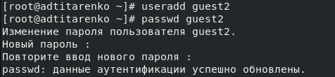
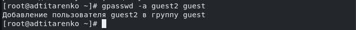
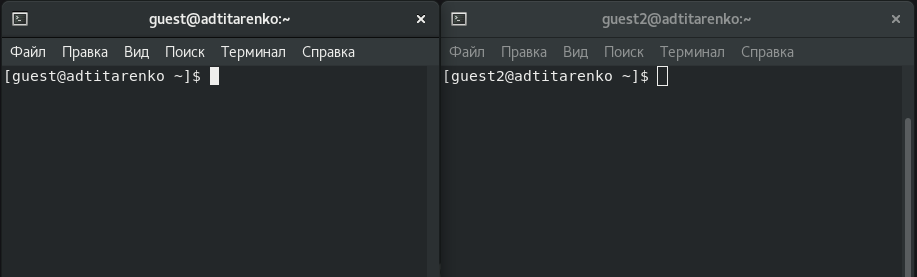
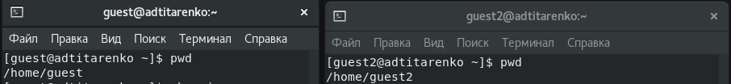
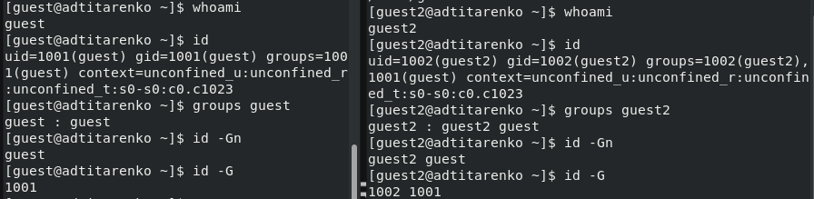
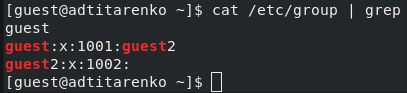
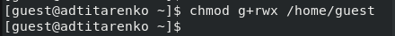
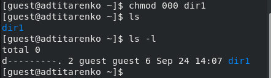
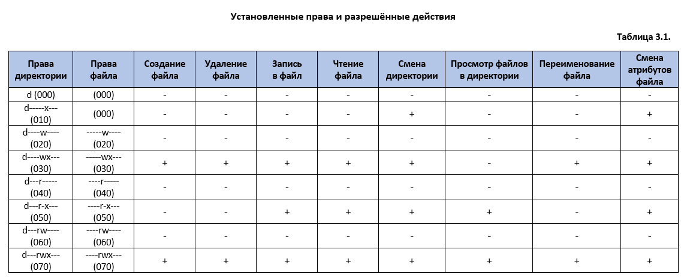
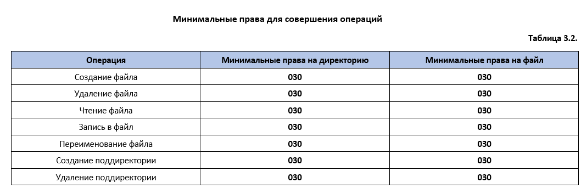

---
# Front matter
title: "Лабораторная работа №3"
author: "Титаренко Анастасия Дмитриевна"

# Generic otions
lang: ru-RU
toc-title: "Содержание"

# Bibliography
bibliography: bib/cite.bib
csl: pandoc/csl/gost-r-7-0-5-2008-numeric.csl

# Pdf output format
toc: true # Table of contents
toc_depth: 2
lof: true # List of figures
lot: true # List of tables
fontsize: 12pt
linestretch: 1.5
papersize: a4
documentclass: scrreprt
## I18n
polyglossia-lang:
  name: russian
  options:
  - spelling=modern
  - babelshorthands=true
polyglossia-otherlangs:
  name: english
### Fonts
mainfont: PT Serif
romanfont: PT Serif
sansfont: PT Sans
monofont: PT Mono
mainfontoptions: Ligatures=TeX
romanfontoptions: Ligatures=TeX
sansfontoptions: Ligatures=TeX,Scale=MatchLowercase
monofontoptions: Scale=MatchLowercase,Scale=0.9
## Biblatex
biblatex: true
biblio-style: "gost-numeric"
biblatexoptions:
  - parentracker=true
  - backend=biber
  - hyperref=auto
  - language=auto
  - autolang=other*
  - citestyle=gost-numeric
## Misc options
indent: true
header-includes:
  - \linepenalty=10 # the penalty added to the badness of each line within a paragraph (no associated penalty node) Increasing the value makes tex try to have fewer lines in the paragraph.
  - \interlinepenalty=0 # value of the penalty (node) added after each line of a paragraph.
  - \hyphenpenalty=50 # the penalty for line breaking at an automatically inserted hyphen
  - \exhyphenpenalty=50 # the penalty for line breaking at an explicit hyphen
  - \binoppenalty=700 # the penalty for breaking a line at a binary operator
  - \relpenalty=500 # the penalty for breaking a line at a relation
  - \clubpenalty=150 # extra penalty for breaking after first line of a paragraph
  - \widowpenalty=150 # extra penalty for breaking before last line of a paragraph
  - \displaywidowpenalty=50 # extra penalty for breaking before last line before a display math
  - \brokenpenalty=100 # extra penalty for page breaking after a hyphenated line
  - \predisplaypenalty=10000 # penalty for breaking before a display
  - \postdisplaypenalty=0 # penalty for breaking after a display
  - \floatingpenalty = 20000 # penalty for splitting an insertion (can only be split footnote in standard LaTeX)
  - \raggedbottom # or \flushbottom
  - \usepackage{float} # keep figures where there are in the text
marp: false
  - \floatplacement{figure}{H} # keep figures where there are in the text
---

# Цель работы

Получение практических навыков работы в консоли с атрибутами файлов для групп пользователей.

# Выполнение лабораторной работы
1. В установленной при выполнении предыдущей лабораторной работы операционной системе создала учётную запись пользователя guest (используя учётную запись администратора)

{ #fig:001 width=70% }

2. Задала пароль для пользователя guest (используя учётную запись администратора)

{ #fig:002 width=70% }

3. Аналогично создала второго пользователя guest2.

{ #fig:003 width=70% }

4. Добавила пользователя guest2 в группу guest: gpasswd -a guest2 guest

{ #fig:004 width=70% }

5. Осуществила вход в систему от двух пользователей на двух разных консолях: guest на первой консоли и guest2 на второй консоли.

{ #fig:005 width=70% }

6. Для обоих пользователей командой pwd определила директорию, в которой нахожусь. /home/guest для пользователя guest и /home/guest2 для пользователя guest2.  Она является домашней директорией.

{ #fig:006 width=70% }

7. Уточнила имя пользователя, его группу, кто входит в неё и к каким группам принадлежит он сам. Определила командами groups guest и groups guest2, в какие группы входят пользователи guest и guest2. Вывод команды groups с выводом команд id -Gn и id -G аналогичен.

{ #fig:007 width=70% }

8. Сравнила полученную информацию с содержимым файла /etc/group. Просмотрела файл командой: cat /etc/group

{ #fig:008 width=70% }

9. От имени пользователя guest2 выполнила регистрацию пользователя guest2 в группе guest командой: newgrp guest

{ #fig:009 width=70% }

10. От имени пользователя guest изменила права директории /home/guest, разрешив все действия для пользователей группы: chmod g+rwx /home/guest

{ #fig:010 width=70% }

11. От имени пользователя guest сняла с директории /home/guest/dir1 все атрибуты командой chmod 000 dirl и проверила правильность снятия атрибутов

{ #fig:011 width=70% }

12. Меняя атрибуты у директории dir1 и файла file1 от имени пользователя guest и делая проверку от пользователя guest2, заполнила табл. 3.1, определив опытным путём, какие операции разрешены, а какие нет. 

Сравнила табл. 2.1 (из лабораторной работы № 2) и табл. 3.1.

{ #fig:012 width=70% }

13. На основании заполненной таблицы определила те или иные минимально необходимые права для выполнения пользователем guest2 операций внутри директории dir1 и заполните табл. 3.2.

{ #fig:013 width=70% }

# Вывод
Приобрела практические навыки работы в консоли с атрибутами файлов для групп пользователей.

# Список литературы
1. [Лабораторная работа № 3. Дискреционное разграничение прав в Linux. Два пользователя](https://esystem.rudn.ru/pluginfile.php/1652021/mod_resource/content/4/003-lab_discret_2users.pdf)