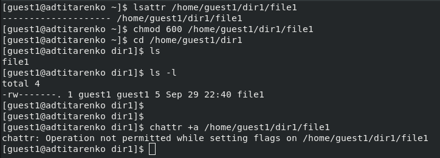
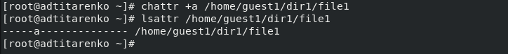
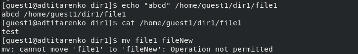
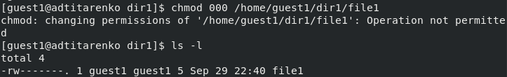
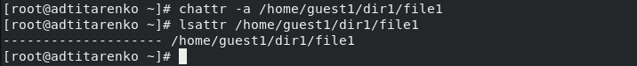
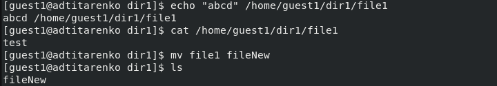
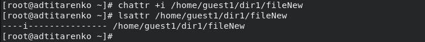
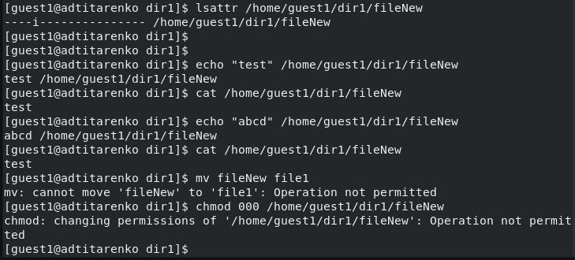

---
## Front matter
lang: ru-RU
title: "Лабораторная работа №4"
subtitle: "Дискреционное разграничение прав в Linux. Расширенные атрибуты"
author:
    Титаренко Анастасия
    НПИбд-02-19\inst{1}
institute: |
	\inst{1}RUDN University, Moscow, Russian Federation
date: 2022, 1 October, Moscow, Russian Federation  

## Formatting
mainfont: PT Serif
romanfont: PT Serif
sansfont: PT Sans
monofont: PT Mono
toc: false
slide_level: 2
theme: metropolis
header-includes: 
 - \metroset{progressbar=frametitle,sectionpage=progressbar,numbering=fraction}
 - '\makeatletter'
 - '\beamer@ignorenonframefalse'
 - '\makeatother'
 - \usepackage[T2A]{fontenc}
 - \usepackage{amsmath}
aspectratio: 43
section-titles: true
---

# Цель работы
Получение практических навыков работы в консоли с расширенными атрибутами файлов.

# Определение расширенных атрибутов файла file1. Изменение прав доступа и попытка установить атрибут а на файл file1

{ #fig:001 width=70% }

# Установка атрибута а на файл file1 от имени суперпользователя

{ #fig:002 width=70% }

# Проверка правильности установления атрибута. Изменение файла file1

{ #fig:003 width=70% }

# Попытка стереть имеющуюся информацию и переименовать файл file1

{ #fig:004 width=70% }

# Установление прав на файл file1

{ #fig:005 width=70% }

# Снятие расширенного атрибута а

{ #fig:006 width=70% }

# Повтор операций после снятия аттрибута а

{ #fig:007 width=70% }

# Установка атрибута i на файл file1 от имени суперпользователя

{ #fig:008 width=70% }

# Повтор операций после установки аттрибута i

{ #fig:009 width=70% }

# Вывод
Приобрела практические навыки работы в консоли с расширенными атрибутами файлов.
