---
## Front matter
lang: ru-RU
title: "Лабораторная работа №5"
subtitle: "Дискреционное разграничение прав в Linux. Исследование влияния дополнительных атрибутов"
author:
    Титаренко Анастасия
    НПИбд-02-19\inst{1}
institute: |
	\inst{1}RUDN University, Moscow, Russian Federation
date: 2022, 8 October, Moscow, Russian Federation  

## Formatting
mainfont: PT Serif
romanfont: PT Serif
sansfont: PT Sans
monofont: PT Mono
toc: false
slide_level: 2
theme: metropolis
header-includes: 
 - \metroset{progressbar=frametitle,sectionpage=progressbar,numbering=fraction}
 - '\makeatletter'
 - '\beamer@ignorenonframefalse'
 - '\makeatother'
 - \usepackage[T2A]{fontenc}
 - \usepackage{amsmath}
aspectratio: 43
section-titles: true
---

# Цель работы
Изучение механизмов изменения идентификаторов, применения SetUID- и Sticky-битов. Получение практических навыков работы в консоли с дополнительными атрибутами. Рассмотрение работы механизма смены идентификатора процессов пользователей, а также влияние бита Sticky на запись и удаление файлов.

# Создание программы

# Листинг программы simpleid.c

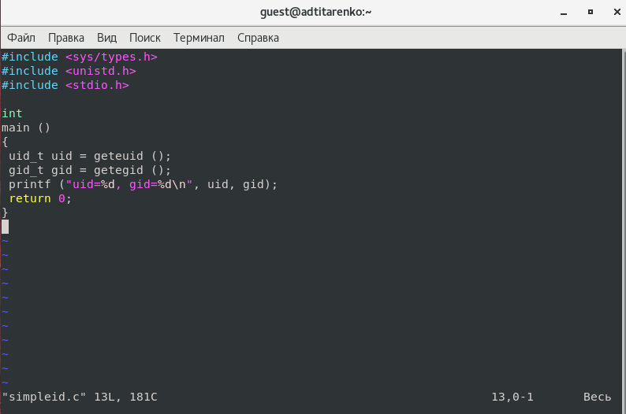{ #fig:001 width=70% }

# Компилирование программы simpleid.c

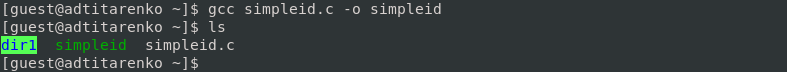{ #fig:002 width=70% }

# Сравнение результата команд ./simpleid и id

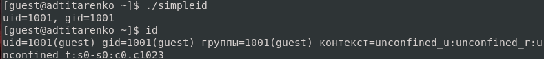{ #fig:003 width=70% }

# Листинг программы simpleid2.c

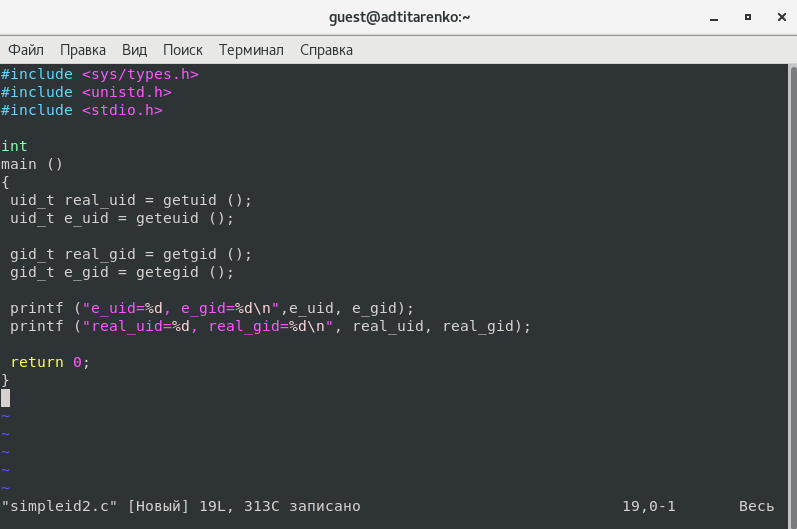{ #fig:004 width=70% }

# Компилирование и запуск программы simpleid2.c

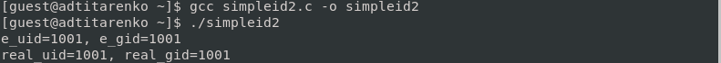{ #fig:005 width=70% }

# Изменение прав доступа файла simpleid2

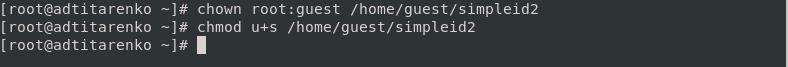{ #fig:006 width=70% }

# Проверка правильности установки новых атрибутов и смены владельца файла simpleid2

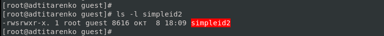{ #fig:007 width=70% }

# Сравнение результата команд ./simpleid2 и id

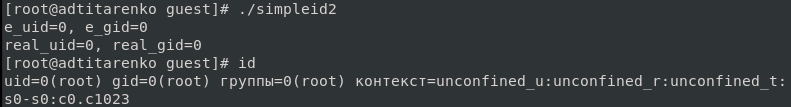{ #fig:008 width=70% }

# Изменения относительно SetGID-бита файла simpleid2

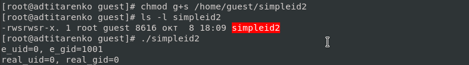{ #fig:009 width=70% }

# Листинг программы readfile.c

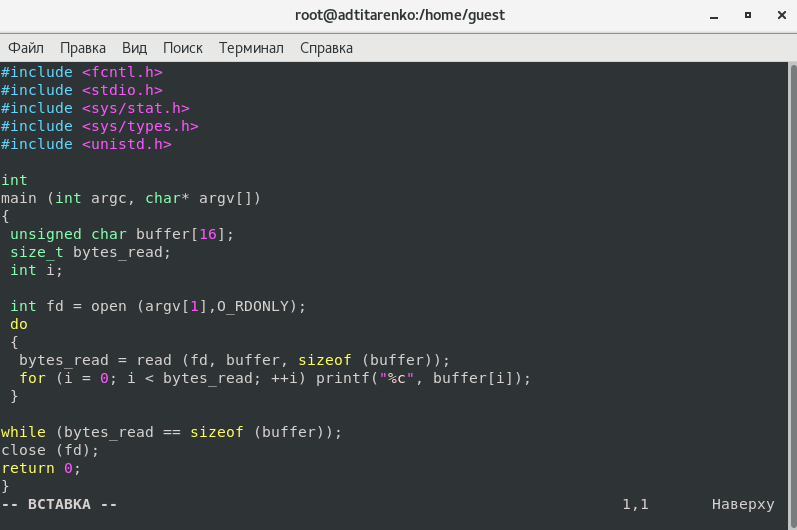{ #fig:010 width=70% }

# Компилирование программы readfile.c

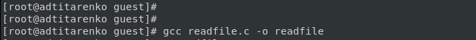{ #fig:011 width=70% }

# Изменения прав файла readfile.c

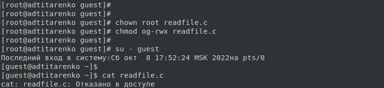{ #fig:012 width=70% }

# Установка SetU’D-бита и изменения владельца файла readfile.c

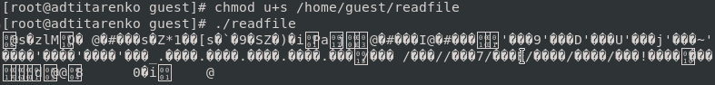{ #fig:013 width=70% }

# Исследование Sticky-бита

# Выполнение команды: ls -l / | grep tmp

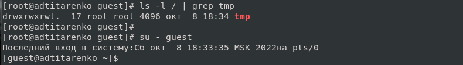{ #fig:014 width=70% }

# Создание файла file01.txt

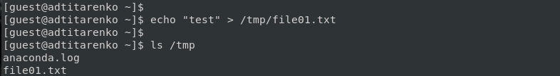{ #fig:015 width=70% }

# Просмотр аттрибутов и изменение прав файла file01.txt

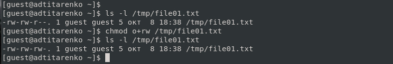{ #fig:016 width=70% }

# Попытка прочитать файл file01.txt от пользователя, не являющегося владельцем

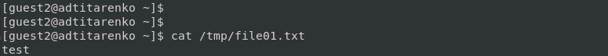{ #fig:017 width=70% }

# Изменение файла file01.txt и просмотр содержимого

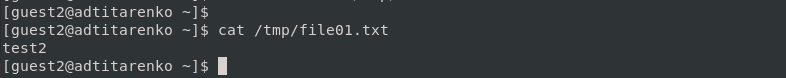{ #fig:018 width=70% }

# Изменение файла file01.txt и просмотр содержимого

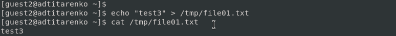{ #fig:019 width=70% }

# Попытка удалить файл file01.txt]

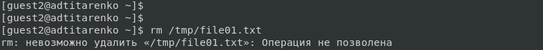{ #fig:020 width=70% }

# Сняла атрибут -t с директории /tmp и покинула режим суперпользователя
 
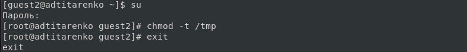{ #fig:021 width=70% }

# Проверка: атрибута -t нет у директории /tmp

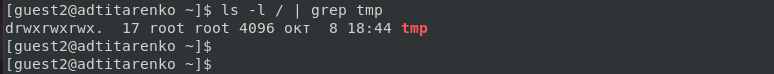{ #fig:022 width=70% }

# Повтор предыдущих шагов

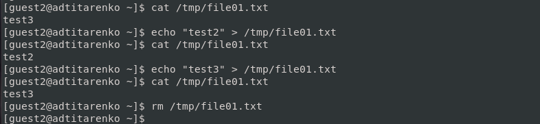{ #fig:023 width=70% }

# Вернула атрибут -t с директории /tmp

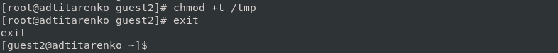{ #fig:024 width=70% }

# Вывод
Изучила механизмы изменения идентификаторов, применения SetUID- и Sticky-битов. Получила практические навыки работы в консоли с дополнительными атрибутами. Рассмотрела работы механизма смены идентификатора процессов пользователей, а также влияние бита Sticky на запись и удаление файлов.
