---
## Front matter
lang: ru-RU
title: "Лабораторная работа №6"
subtitle: "Мандатное разграничение прав в Linux"
author:
    Титаренко Анастасия
    НПИбд-02-19\inst{1}
institute: |
	\inst{1}RUDN University, Moscow, Russian Federation
date: 2022, 15 October, Moscow, Russian Federation  

## Formatting
mainfont: PT Serif
romanfont: PT Serif
sansfont: PT Sans
monofont: PT Mono
toc: false
slide_level: 2
theme: metropolis
header-includes: 
 - \metroset{progressbar=frametitle,sectionpage=progressbar,numbering=fraction}
 - '\makeatletter'
 - '\beamer@ignorenonframefalse'
 - '\makeatother'
 - \usepackage[T2A]{fontenc}
 - \usepackage{amsmath}
aspectratio: 43
section-titles: true
---

# Цель работы
Развить навыки администрирования ОС Linux. Получить первое практическое знакомство с технологией SELinux. Проверить работу SELinx на практике совместно с веб-сервером Apache.

# Проверка, что SELinux работает в режиме enforcing политики targeted

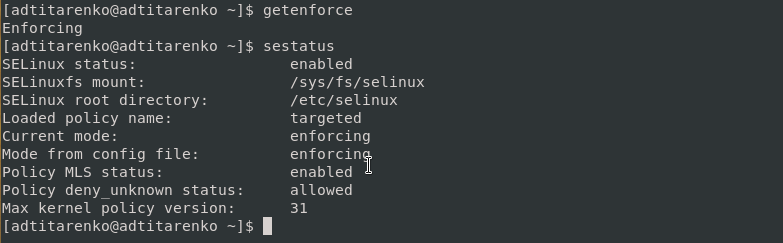{ #fig:001 width=70% }

# Проверка, что веб-сервис запущен

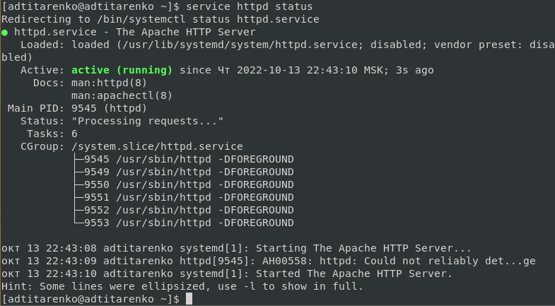{ #fig:002 width=70% }

# Нахождение веб-сервер Apache в списке процессов

{ #fig:003 width=70% }

# Текущее состояние переключателей SELinux для Apache

{ #fig:004 width=70% }

# Статистика по политике с помощью команды seinfo

{ #fig:005 width=70% }

# Типы файлов и поддиректорий, находящихся в директории /var/www

{ #fig:006 width=70% }

# Типы файлов, находящихся в директории /var/www/html

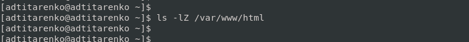{ #fig:007 width=70% }

# Создание html-файла test.html

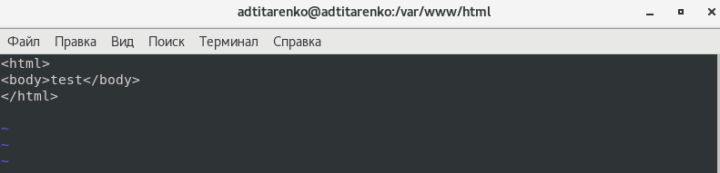{ #fig:009 width=70% }

# Контекст созданного файла

{ #fig:010 width=70% }

# Обращение к файлу через веб-сервер

{ #fig:011 width=70% }

# Справка man httpd

{ #fig:012 width=70% }

# Изменение контекста файла /var/www/html/test.html

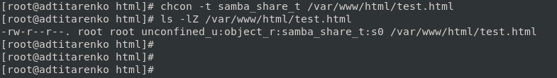{ #fig:013 width=70% }

# Доступ к файлу через веб-сервер

{ #fig:014 width=70% }

# log-файлы веб-сервера Apache

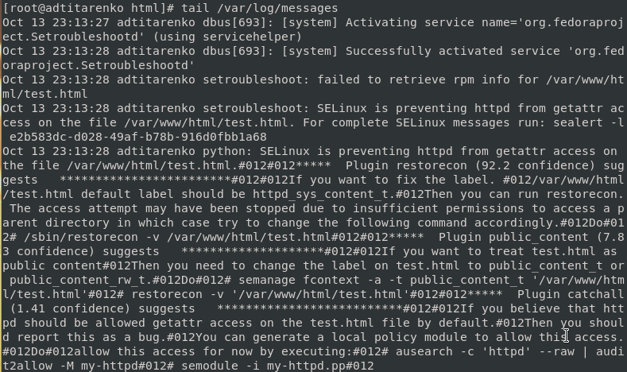{ #fig:015 width=70% }

# Запуск веб-сервер Apache на прослушивание ТСР-порта 81

{ #fig:016 width=70% }

# Перезапуск веб-сервера Apache

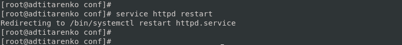{ #fig:017 width=70% }

# Лог-файлы: tail -nl /var/log/messages

{ #fig:018 width=70% }

# Файл /var/log/http/error_log

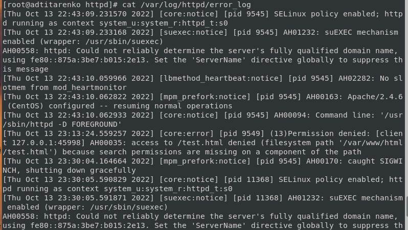{ #fig:019 width=70% }

# Файлы /var/log/http/access_log и /var/log/audit/audit.log

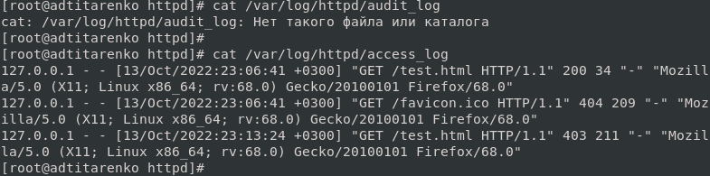{ #fig:020 width=70% }

# Список портов

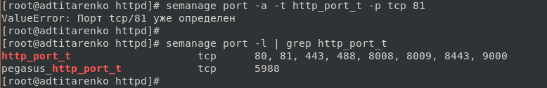{ #fig:021 width=70% }

# Возвращение контекста httpd_sys_cоntent__t к файлу /var/www/html/test.html

{ #fig:022 width=70% }

# Доступ к файлу через веб-сервер

{ #fig:023 width=70% }

# Исправление конфигурационного файла apache (Listen 80)

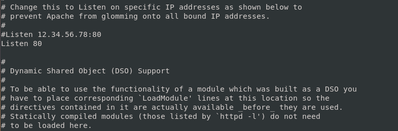{ #fig:024 width=70% }

# Удаление привязки http_port_t к 81 порту

{ #fig:025 width=70% }

# Удаление файла /var/www/html/test.html

{ #fig:026 width=70% }

# Вывод
Развила навыки администрирования ОС Linux. Получила первое практическое знакомство с технологией SELinux. Проверила работу SELinx на практике совместно с веб-сервером Apache.
