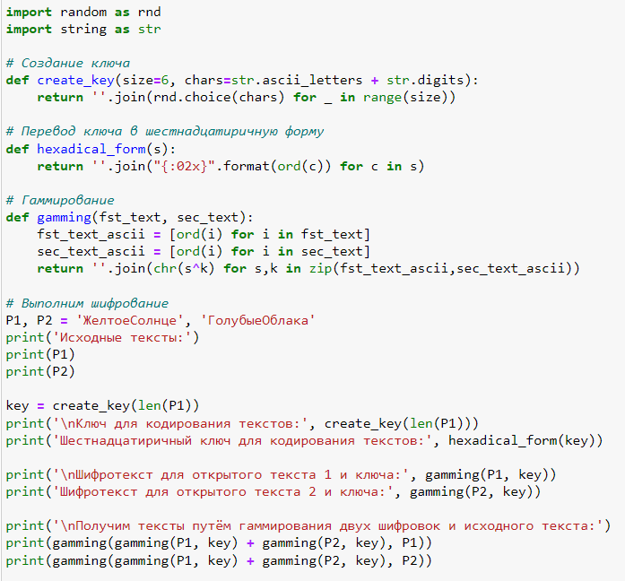
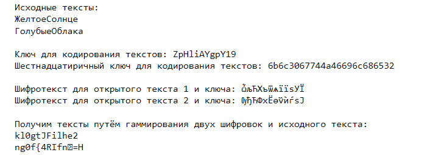

---
## Front matter
lang: ru-RU
title: "Лабораторная работа №8"
subtitle: "Элементы криптографии. Шифрование (кодирование) различных исходных текстов одним ключом"
author:
    Титаренко Анастасия
    НПИбд-02-19\inst{1}
institute: |
	\inst{1}RUDN University, Moscow, Russian Federation
date: 2022, 29 October, Moscow, Russian Federation  

## Formatting
mainfont: PT Serif
romanfont: PT Serif
sansfont: PT Sans
monofont: PT Mono
toc: false
slide_level: 2
theme: metropolis
header-includes: 
 - \metroset{progressbar=frametitle,sectionpage=progressbar,numbering=fraction}
 - '\makeatletter'
 - '\beamer@ignorenonframefalse'
 - '\makeatother'
 - \usepackage[T2A]{fontenc}
 - \usepackage{amsmath}
aspectratio: 43
section-titles: true
---

# Цель работы
Освоить на практике применение режима однократного гаммирования на примере кодирования различных исходных текстов одним ключом.

# Листинг программы

{ #fig:001 width=70% }

# Вывод программы

{ #fig:002 width=70% }

# Вывод
Освоила на практике применение режима однократного гаммирования на примере кодирования различных исходных текстов одним ключом.
